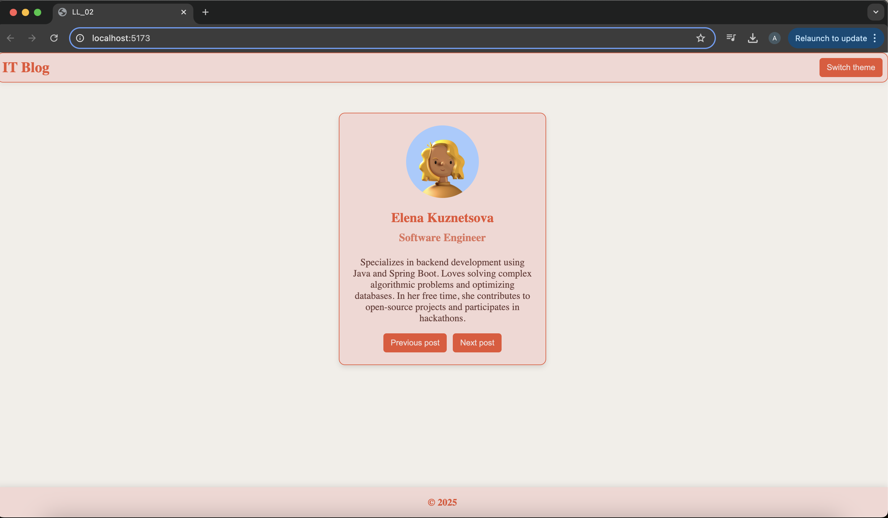

# Project Documentation

One of the simplest way to style components in React is by using CSS files. This is a familiar method that you use in HTML, and it remains relevant for React. All styles are placed in a single file, such as index.css,in my case, App.css,and are imported into the main component (main.jsx).

## CSS Overview

### 1. Header (.header)
The header is styled with a flexbox layout, aligning elements horizontally and centering them. 

   * `display:` flex; - Aligns items in a row.
   *  `justify-content:` space-between; - Spreads elements apart.
   *  `align-items: center;` - Centers elements vertically.
   *  `border-radius: 10px;` - Adds rounded corners.
   *  `background-color: #f2d7d3;` - Light pink background.
   *  `color: #e85234;` - Red text color.
   *  `box-shadow: 0 0 10px rgba(0, 0, 0, 0.1);` - Adds subtle shadow.

### 2. Header's title (.title)
The title is styled to be bold and prominent.

  * `font-size: 24px;` - Increases text size.
  * `font-weight: bold;` - Makes text stand out.

### 3. Buttons (button)
Buttons have a red background and smooth hover effects for better interactivity.

  * `background-color: #e85234;` - Red background.
  * `color: #f2d7d3;` - Light pink text.
  * `border-radius: 5px;` - Rounded edges.
  * `cursor: pointer;` - Changes cursor on hover.
  * `transition: background-color 0.3s ease;` - Smooth hover transition.
  * `button:hover { background-color: #f9b8af;` - Light pink hover effect.

### 4. Light & Dark Modes (.light, .dark)
These classes apply different background colors for theme switching.

  * `.light { background-color: #f2eee9; }` - Light beige for light mode.
  * `.dark { background-color: #59585e; }` - Dark gray for dark mode.

### 5. Profile Card (.profile)
A centered profile card with a light pink background, rounded corners, and a subtle shadow.

  * `display: flex; flex-direction: column;` - Aligns content in a column.
  * `align-items: center; justify-content: center;` - Centers content.
  * `width: 300px; padding: 20px;` - Defines the card size.
  * `background-color: #f2d7d3;` - Light pink background.
  * `border-radius: 10px;` - Rounded edges.
  * `box-shadow: 0 4px 8px rgba(0, 0, 0, 0.1);` - Soft shadow effect.
  * `margin: auto; margin-top: 220px;` - Centers the card on the page.

### 6. Avatar (.avatar)
The profile picture is circular and resizes properly.

  * `width: 120px; height: 120px;` - Defines image size.
  * `border-radius: 50%;` - Creates a circular shape.
  * `object-fit: cover;` - Ensures the image fills the space correctly.

### 7. Name, Position, and Description (.name, .position, .description)
Each text element is styled to maintain hierarchy and readability.

  * `.name { font-size: 22px; font-weight: bold; color: #e85234; }`
  * `.position { font-size: 18px; color: #e0725c; }`
  * `.description { font-size: 16px; color: #555; line-height: 1.5; }`

### 8. Footer (.footer)
The footer is fixed at the bottom with a light pink background and centered text.

  * `display: flex; justify-content: center; align-items: center;` - Centers content.
  * `position: fixed; bottom: 0; left: 0; width: 100%;` - Sticks to the bottom.
  * `background-color: #f2d7d3;` - Light pink background.
  * `color: #e85234;` - Red text color.
  * `box-shadow: 0 -2px 10px rgba(0, 0, 0, 0.1);` - Subtle top shadow.

## Instructions for Running the Project

  1. Navigate to the project folder:

    `cd <path to the project folder>`

  2. Install dependencies:

    `npm install`
    
  3. Run the project:

    `npm run dev`

## Use Cases for This Styling Method

- Small Projects: Suitable for small projects where styles can be stored in a single file.
- Easy Integration: Can be easily applied to any project, regardless of the technology stack.
- Team Collaboration: Each developer can work on the styles of their own component without affecting others.

### The following image illustrates the successful launch of the project:

