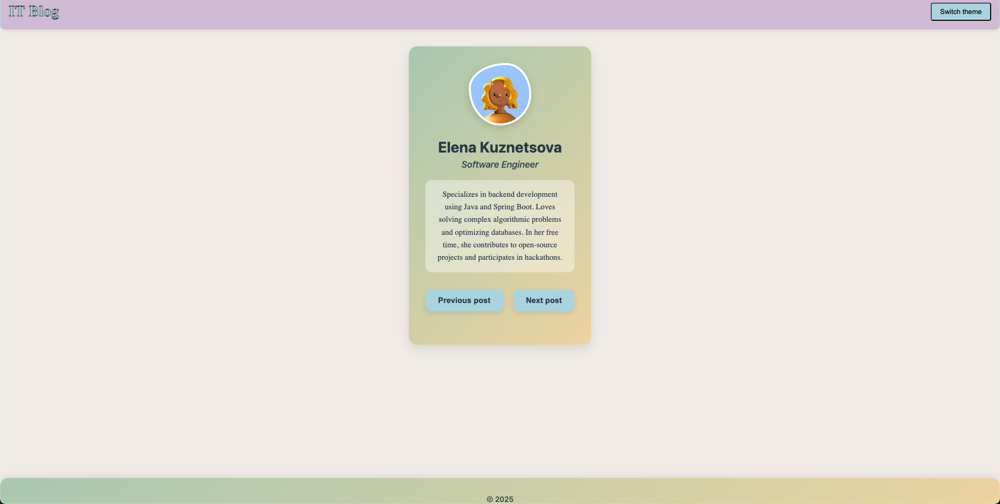

# Project Documentation

SCSS is a powerful extension of CSS that introduces new features such as variables, nested rules, mixins, and more. It simplifies style development and maintenance, and after compilation, it is converted into standard CSS that is compatible with browsers.

## SCSS OVERVIEW

### **Variables usage:** 

Variables allow for centralized style changes. For example, a single color can be reused in multiple places.

  ```jsx
    $primary-color: #d7c2d8;
    $font-color: #b3d9e1;
  
    //FOR HEADER COMPONENT
    background-color: $primary-color;
    border: 1px solid $font-color;
  
    //FOR BUTTON
    background-color: $font-color;
  ```

### **`&` Usage for references to the parent element:**

  ```jsx
    .avatar {
        width: 120px;
        height: 120px;
        border-radius: 60% 40% 50% 50% / 40% 50% 50% 60%;
        object-fit: cover;
        border: 4px solid white;
        box-shadow: 0 5px 15px rgba(0, 0, 0, 0.15);
        margin-bottom: 1.5rem;
        transition: transform 0.3s ease;
    
        &:hover { 
            transform: scale(1.05);
            border-radius: 50%;
        }
    }
  ```

### Mixins for media queries

Mixins in SCSS are a mechanism for reusing blocks of styles, allowing you to conveniently and efficiently insert sets of styles into other rules or components. They serve as templates for CSS rules that can be used repeatedly, which significantly reduces code duplication.

Mixins are defined with the `@mixin` keyword and then used with the `@include` keyword. Mixins can accept parameters, which makes them even more flexible.

In my example, mixins are used to create responsive styles that apply depending on the screen width (using media queries). Each mixin (sm, md, lg, xl) contains a media query that applies if the screen width matches a specific minimum value. You have used these mixins inside the styling of elements to adapt sizes, margins, and other properties for different screens.

**Еxample:**

Mixins/_media-query.scss:

  ```
    @mixin sm {
        @media screen and (min-width: $xs) {
          @content;
        }
      }
      
      @mixin md {
        @media screen and (min-width: $sm) {
          @content;
        }
      }
      
      @mixin lg {
        @media screen and (min-width: $md) {
          @content;
        }
      }
      
      @mixin xl {
        @media screen and (min-width: $lg) {
          @content;
        }
      }
  ```

.header:

  ```
          @include sm {
              font-size: 1.8rem;
          }
  
          @include md {
              font-size: 2rem;
          }
  
          @include lg {
              font-size: 2.2rem;
          }
  
          @include xl {
              font-size: 2.5rem;
          }
  
  ```
### Import

SCSS supports file imports for code organization. Now, CSS can be split into several logical parts and imported into a single file.

**Final Project structure:**
```
 src/
  │── assets/
  │── components/
  │   │── Footer.jsx
  │   │── Header.jsx
  │   │── profiles.js
  │   │── Slider.jsx
  │   │── ThemeSwitcher.jsx
  │── styles/
  │   │── main.scss
  │   ├── components/
  │   │   │── _all.scss
  │   │   │── _app.scss
  │   │   │── _footer.scss
  │   │   │── _header.scss
  │   │   │── _slider.scss
  │   ├── mixins/
  │   │   │── _media-query.scss
  │   │   │── _variables.scss
  │── App.jsx
  │── main.jsx
  |── ...
```

## Instructions for Running the Project

  1. Navigate to the project folder:

    `cd <path to the project folder>`

  2. Install dependencies:

    `npm install`

  3. Install SCSS:

     `npm install sass`
    
  4. Run the project:

    `npm run dev`


## Use Cases for SCSS:

 - Large projects with repeating styles: SCSS allows you to use variables, mixins, and inheritance, which reduces code duplication.
 - Team development: SCSS helps to divide styles into modules (as in your project: `_footer.scss, _header.scss`), making support and code readability easier.
 - Responsive design: With media queries in mixins, you can centrally manage adaptation.
 - Projects with a consistent design: Variables in `_variables.scss` allow you to define uniform colors, fonts, and spacing and use them throughout the project.
 - Faster development: Nesting `(.menu { .item { color: red; } })` makes the code shorter and more convenient than regular CSS.

### The following image illustrates the successful launch of the project:



 
