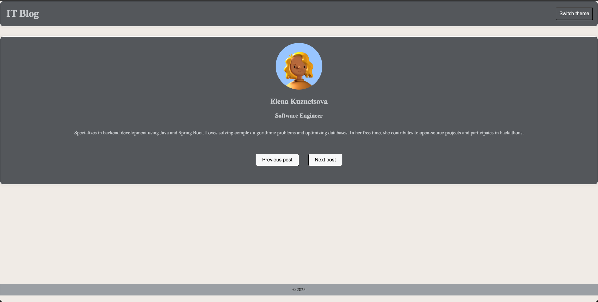

# Project Documentation 

CSS-in-JS is a styling approach that allows writing styles directly within JavaScript code. This simplifies style management and tightly integrates styles with component logic.

**Project's Structure**

  ```
    src/
    │── assets/            
    │── components/        
    │   ├── Footer.jsx
    │   ├── Header.jsx
    │   ├── profiles.js
    │   ├── Slider.jsx
    │   ├── ThemeSwitcher.jsx
    │── styles/            
    │   ├── theme/         
    │   │   ├── theme.js   
    │   ├── main.scss      
    │── App.jsx            
    │── main.jsx   
    |── ...
  ```

## CSS-in-JS Overview

**`styled-components`** is a popular library for styling React applications using the CSS-in-JS approach. It allows you to write CSS styles directly in JavaScript and bind them to components dynamically. 

Features
  - [X] Scoped styles (no class name conflicts)
  - [X] Dynamic styling with props
  - [X] Supports themes and global styles
  - [X] Uses real CSS syntax, including nesting and pseudo-selectors

**Example**

In Header component created two items styles with `styled-components`: Wrapper and HeaderTitle:

  ✧ Wrapper for header wrapper;
  
  ✧ HeaderTitle for title iself;

  ```
    import ThemeSwitcher from "./ThemeSwitcher"
    import styled from 'styled-components';
    
    const Wrapper = styled.header`
        display: flex;
        justify-content: space-between;
        margin-bottom: 2rem;
        border-radius: 10px;
        border: 1px solid ${(props) => props.theme.colors.background};
        background-color: ${(props) => props.theme.colors.primary};
        box-shadow: 0 0 10px rgba(0, 0, 0, 0.1);
    `;
    const HeaderTitle = styled.h1`
            font-size: 2rem;
            font-weight: 600;
            color: ${(props) => props.theme.colors.extra};
            padding-left: 20px;
        `;
    
    export default function Header({changeTheme}) {
    
        return (
            <Wrapper>
                <HeaderTitle>IT Blog</HeaderTitle>
                <ThemeSwitcher onClick={changeTheme}/>
            </Wrapper>
        )
    }
```

**Theme Object**

The theme object is used in Styled-Components (or other styling systems) to define a global theme for a React application. This allows you to manage colors, fonts, and other styles in a centralized way, making it easier to maintain consistency across components.

  ```
    export const theme = {
        colors: {
          primary: '#5f6266',
          border: '#a5a9ae',
          extra: '#cfd1d4',
          background: '#f8f9fa',
        },
      
        fonts: {
          heading: 'Rowdies',
          body: 'Inter',
        },
    }
 ```

Usage example in Header component. The background is styled using the styled.header component, which automatically generates a unique class. The background's color depends on the value of the theme.colors.primary variable.

  ```
    background-color: ${(props) => props.theme.colors.primary};
  ```

**Theme import**: In order to pass the theme to a component, the `ThemeProvider` component from the `styled-components` library is used.

  ```
    //main.jsx
    import { ThemeProvider } from 'styled-components';
    
    createRoot(document.getElementById('root')).render(
      <StrictMode>
        <ThemeProvider theme={theme}>
        <App />
        </ThemeProvider>
      </StrictMode>,
    )
  ```

## Instructions for Running the Project

  1. Navigate to the project folder:

    `cd <path to the project folder>`

  2. Install dependencies:

    `npm install`
    
  3. Run the project:

    `npm run dev`


## Use Cases for CSS-in-JS:
 - Dynamic Styling Based on Props.
 - Conditional Styling: ```color: ${({ isPrimary }) => (isPrimary ? 'blue' : 'black')};```
 - Component-Level Scoped Styles: Each component has its own isolated styles.

### The following image illustrates the successful launch of the project:




