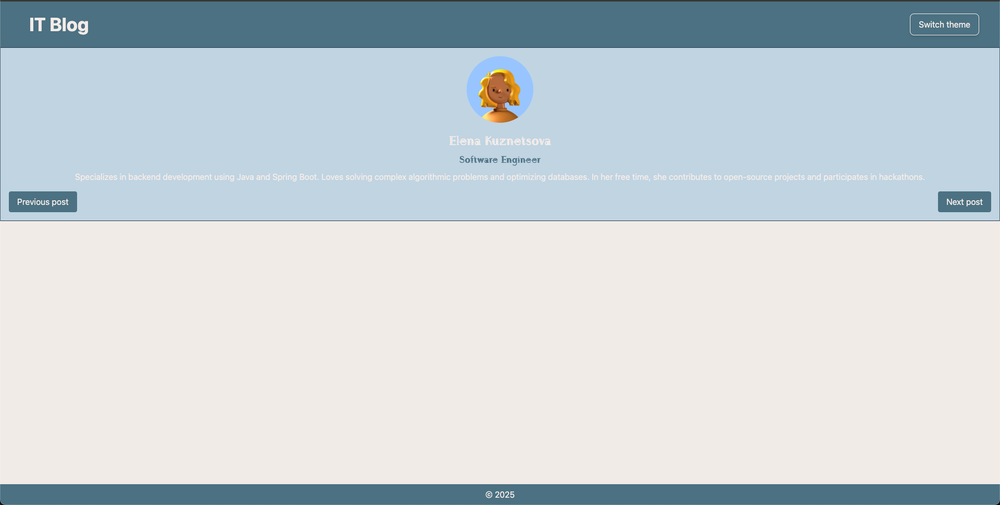

# Project Documentation

Tailwind CSS is a utility-first CSS framework that simplifies web development by providing a set of pre-designed utility classes. The best part is, we do not have to write these utility classes ourselves and keep them in any global CSS file. We directly get them from Tailwind.

**Project's Structure**


        src/
        ├── assets/
        ├── components/
        │   ├── Footer.jsx
        │   ├── Header.jsx
        │   ├── profiles.js
        │   ├── Slider.jsx
        │   ├── ThemeSwitcher.jsx
        ├── styles/
        │   ├── main.css
        │   ├── theme.css
        ├── App.jsx
        ├── main.jsx
        |── ...
    
    
## TAILWIND CSS Overview

**With the @theme directive, you can create custom variables and colors.**

  ```
    @theme {

      /* Adding custom colors */

        --color-primary: #c8d9e6;
        --color-secondary: #567c8d;
        --color-border: #2f4156;
        --color-font: #f5efeb;
        --color-light: #ffffff;
      
      
        --font-serif: 'Agu Display', ui-serif, Georgia, Cambria, 'Times New Roman', Times, serif;
        
      }
  ```

**Usage example on the base of Header component**

  ```
    // src/components/Header.jsx
    import ThemeSwitcher from "./ThemeSwitcher";
    
    export default function Header({ changeTheme }) {
      return (
        <header className={"py-4 px-10 flex justify-between bg-secondary items-center w-full"}>
          <h1 className="text-4xl text-font font-bold px-4 py-2 hover:text-border">IT Blog</h1>
          <ThemeSwitcher onClick={changeTheme} />
        </header>
      );
    }
  ```


- `py-4` → Adds vertical padding (padding-top and padding-bottom), 4 = 16px.
- `px-10` → Adds horizontal padding (padding-left and padding-right).
- `flex` → Applies display: flex;, making the element a flex container.
- `justify-between` → Distributes child elements with space between them (justify-content: space-between;).
- `bg-secondary` → Sets the background color to secondary (which is defined in the Tailwind theme).
- `items-center` → Aligns items along the cross-axis (vertically in a row layout) to the center (align-items: center;).
- `w-full` → Sets the width to 100% (width: 100%;).


## Instructions for Tailwind CSS Launching

  1. Install the dependencies:

    `npm install tailwindcss @tailwindcss/postcss postcss`

  2. Create the configuration `postcss.config.mjs` in the project's root and add plagin Tailwind CSS: `"@tailwindcss/postcss": {},`

  ```
      // postcss.config.mjs
      export default {
        plugins: {
          '@tailwindcss/postcss': {},
        },
      };
  ```

  4. Connect the Tailwind:

    `@import 'tailwindcss';`

  5. Run the project.

## Use Cases Tailwind CSS:

 - Single Page Application (SPA);
 - Component-Based Development
 - Mobile Application (PWA / Hybrid);

### The following image illustrates the successful launch of the project:


