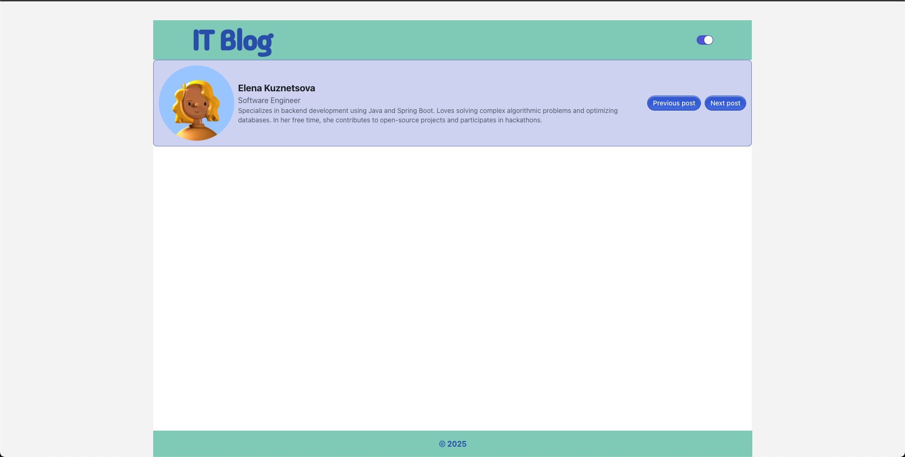

# Project's Documentation

To simplify working with CSS and speed up interface development, developers can use pre-styled libraries such as RadixUI, Chakra UI, Ant Design, and others. In current project I used `RadixUI`.

**Project's Structure:**

    src/
    │── assets/           
    │── components/        
    │   ├── Footer.jsx     
    │   ├── Header.jsx     
    │   ├── profiles.js    
    │   ├── Slider.jsx     
    │   ├── ThemeSwitcher.jsx 
    │── styles/            
    │   ├── main.css       
    │── App.jsx            
    │── main.jsx       
    |── ...

## RadixUI Overview

**Key Features of @radix-ui/themes:**

 - Pre-built Components: Includes ready-to-use UI elements such as cards, buttons, and text components.
 - Theme Customization: Allows setting colors, fonts, and border-radius using a declarative syntax.
 - Responsive Support: Easily integrates with media queries and utility classes for adaptive design.
 - Tailwind CSS Compatibility: Can be seamlessly combined with Tailwind utility classes for flexible styling.

Usage example on the base of Header component. In the RadixUI's documenation I found `Heading, Flex, Box` components and customized the component `Header` to fit my project's needs.

  ```
    import ThemeSwitcher from "./ThemeSwitcher"
    import {Heading, Flex, Box} from '@radix-ui/themes';
    
    export default function Header({changeTheme}){
    
        return(
            <Box py="3" style={{ backgroundColor: "var(--mint-a7)"}}>
            <Flex align="center" justify="center" direction="row" gap="900px">
                <Heading align="center" color="iris" size="9">IT Blog</Heading>
                <ThemeSwitcher onClick={changeTheme}/>
            </Flex>  
            </Box>
        )
    }
  ```

## Installation 

1. Install the library `@radix-ui/themes`.

   ```
     npm install @radix-ui/themes


2. Connect the library's styles to the global styling file.
   
   ```
     /* main.css */
     @import '@radix-ui/themes/styles.css';
  

## Use Cases of pre-styled libraries:

 - Development Speed;
 - A convenient way to centrally manage styles;
 - The ability to integrate with other tools, such as Tailwind CSS;

### The following image illustrates the successful launch of the project:


